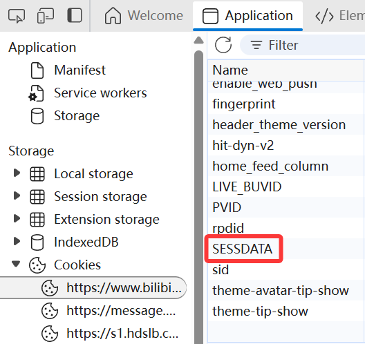
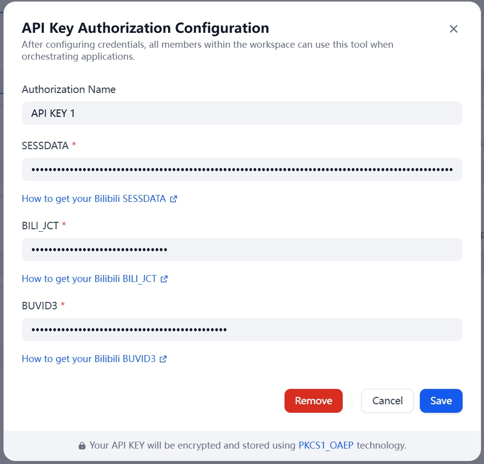
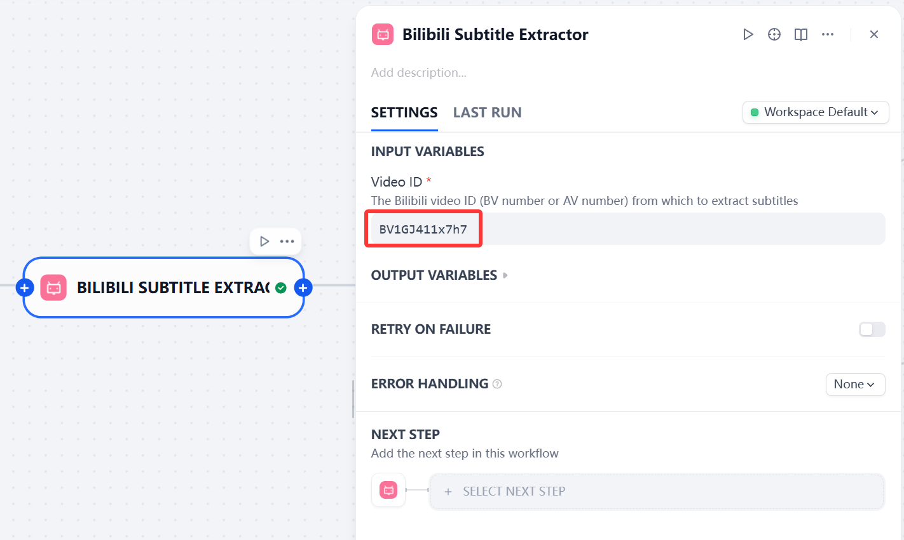
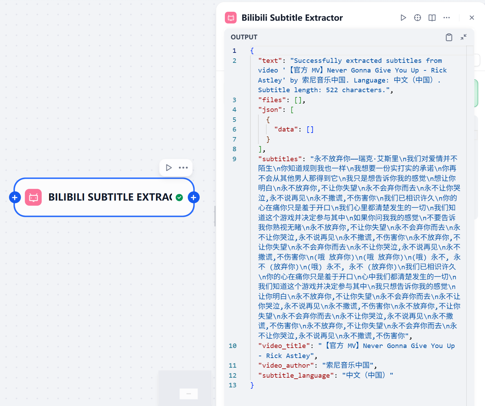

# Bilibili Subtitle Extraction Plugin

## Introduction

This is a Dify plugin for extracting subtitles from Bilibili videos. By providing a video ID, the plugin can automatically retrieve and return the subtitle content of the video, facilitating content analysis, learning, or other purposes.

## Features

- Extract Bilibili video subtitles using video ID
- Return basic video information such as title and author
- Support multiple video ID formats including BV and AV numbers
- Simple and user-friendly interface design

## Prerequisites

To use this plugin, you need to provide the following Cookie information from your Bilibili account:

- SESSDATA
- BILI_JCT
- BUVID3

This information can be obtained from the browser's developer tools after logging into Bilibili.

### How to Obtain Credentials

Follow the steps shown in the image above to obtain Cookie information:
1. Log in to the Bilibili website
2. Open browser developer tools (F12)
3. Switch to the Application/Storage tab
4. Find the Cookies section on the left
5. Click on the bilibili.com domain
6. Find and copy the values of SESSDATA, BILI_JCT, and BUVID3

**Important Notice: Credentials Will Expire**

- Cookie information (SESSDATA, BILI_JCT, BUVID3) has a limited lifespan and will typically expire after some time
- If the plugin encounters authentication failures or cannot retrieve subtitles, please obtain fresh Cookie information
- It is recommended to update credential information regularly to ensure the plugin works properly

## Usage

1. Install this plugin on the Dify platform
2. Configure the necessary Cookie information

3. Enter a Bilibili video ID, for example: ``BV1GJ411x7h7``

4. The plugin will automatically extract and return subtitle content

## Notes

- Can only extract subtitles from videos that already have subtitles; does not support automatic subtitle generation
- Currently defaults to Chinese subtitles, or the first available subtitle if Chinese is not available
- Requires valid Bilibili account Cookie information
- Video ID must be a valid Bilibili video ID
- Supports multiple formats including BV and AV numbers

## Privacy Statement

This plugin is only used to extract subtitle content from public videos and does not collect or store users' personal information. The provided Cookie information is only used for API access authorization and will not be used for other purposes.

## Referenced Projects

This project referenced the following excellent open-source projects during development:

- [dify-plugin-Bilibili-Search](https://github.com/jingfelix/dify-plugin-Bilibili-Search) - A Bilibili search plugin for the Dify platform, providing reference implementation for plugin development
- [bilibili-api](https://github.com/Nemo2011/bilibili-api) - A comprehensive Bilibili API library providing rich API interface references

Thanks to the contributors of these projects for their contributions to the open-source community.

## License

This project is licensed under the MIT License.